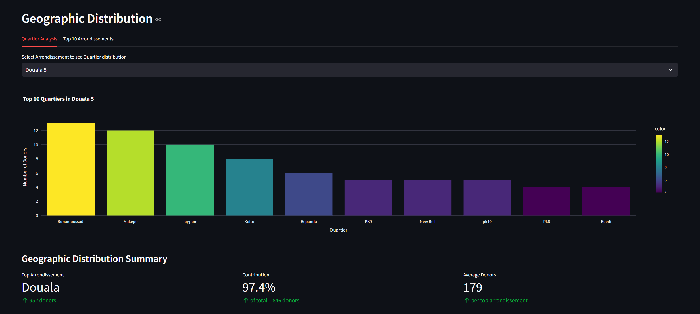
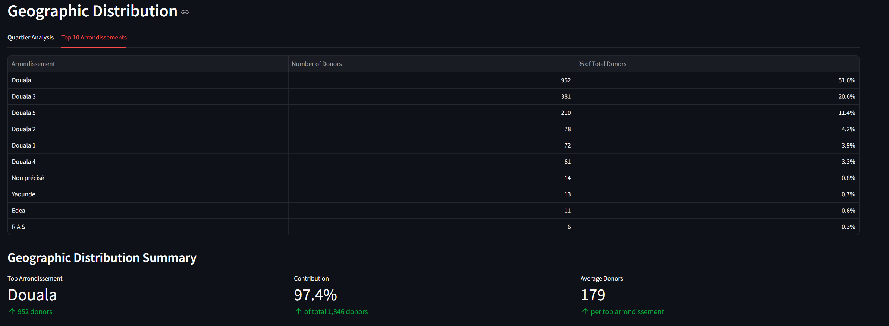
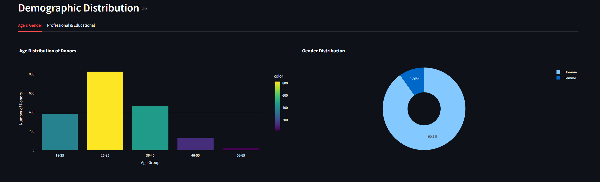
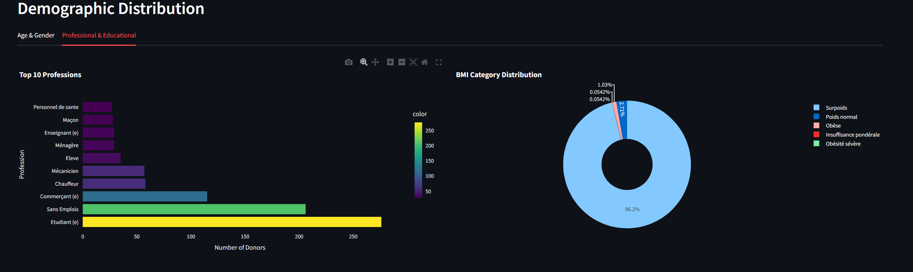
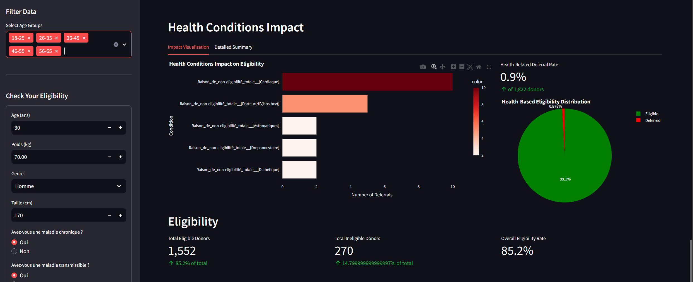
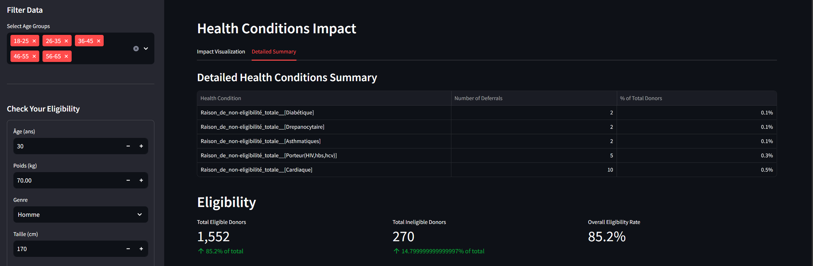
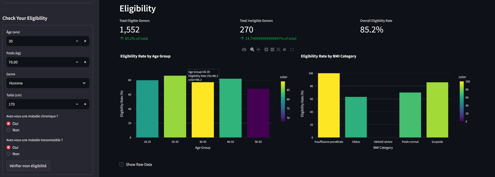

# Blood Donation Campaign Dashboard

[](LICENSE)
[](https://www.python.org/downloads/)
[](https://streamlit.io/)
[](docs/mkdocs.yml)

A comprehensive data analytics and visualization dashboard for blood donation campaigns, developed for IndabaX Cameroon 2025 Hackathon. This tool helps campaign organizers make data-driven decisions to improve blood donation initiatives through real-time analytics, donor profiling, and campaign effectiveness tracking.

# Usefull links
Asides the dashboard, here are some extra features we added.

- [Blood donation campaign dashboard](https://blood-donation-campaign-dashboard.streamlit.app/) The web application for the blood donation campaign dashboard.
- [Documentation](https://alphonsebrandon.github.io/blood_donation_campaign_dashboard/) Technical and non technical documentation for the project.
- [Eligibility checker website](https://testsiteg.pythonanywhere.com/) to check if you are eligible to donate blood.
- [Link donors to care center website](https://bd-carelink.onrender.com) Website to link eligible donors to care centers.

Here is the dashboard overview: 
- [Dashboard overview in English](/reports/Dashboard_Overview_English.md)
- [Dashboard overview in French](/reports/Dashboard_Overview_French.md)


## 🎯 Project Overview

The Blood Donation Campaign Dashboard addresses critical challenges in blood donation management by providing:

- Real-time analytics for campaign effectiveness
- Donor behavior and retention analysis
- Geographic distribution visualization
- Health metrics tracking
- Demographic insights

### 🌟 Key Features

- **Geographic Analysis**
  - Interactive maps showing donor distribution
  - Region-wise donation patterns
  - Identification of underserved areas

- **Demographic Insights**
  - Age and gender distribution analysis
  - Professional sector contribution tracking
  - Socio-economic pattern recognition

- **Health Metrics**
  - Eligibility rate tracking
  - Health condition impact analysis
  - BMI and hemoglobin level monitoring

- **Campaign Effectiveness**
  - Success rate visualization
  - Temporal trend analysis
  - Demographic contribution metrics

- **Donor Retention**
  - Repeat donor tracking
  - Engagement pattern analysis
  - Retention rate visualization

### 📊 Dashboard Preview

### Geographic Distribution

- Regional donor mapping
- Population density analysis
- Location-based metrics

### Top 10 quaters in sub-division, in (this case Douala 5)


### Top 10 sub-divisions in region, in (this case Littoral)


### Donor Profiling

- Demographic analysis
- Health condition impact
- Retention patterns
- Medical factor impact

### Demographic Distribution By Age & Gender


### Demographic Distribution By Profession & Educational Level and BMI Category


### Health condition impact analysis


### Health Condition Summary


### Campaign Analytics

- Temporal trends
- Success metrics
- Demographic contributions

### Demographic Contribution Metrics


## 🚀 Getting Started

### Prerequisites

- Python 3.8+
- pip package manager
- Make (optional, for using Makefile commands)

### Installation

1. Clone the repository:
```bash
git clone https://github.com/yourusername/blood-donation-dashboard.git
cd blood-donation-dashboard
```

2. Create and activate a virtual environment:
```bash
python -m venv .venv
source .venv/bin/activate  # On Windows: .venv\Scripts\activate
```
3. Install dependencies:
```bash
pip install -r requirements.txt
```

4. Run the dashboard:
```bash
streamlit run src/dashboard.py
```

### 🛠️ Development

*Running Test*
```bash
python -m pytest tests/
```

*Code Style*
This project follows PEP 8 guidelines. To check code style:
```bash
flake8 src/
``` 


### 📂 Directory Details

- **`data/`**: Stores all project data files
  - `raw/`: Original, immutable data
  - `processed/`: Clean, analysis-ready data
  - `interim/`: Intermediate processing steps
  - `external/`: Data from third-party sources

- **`src/`**: Core source code
  - `app.py`: Main Streamlit dashboard application
  - `data_loader.py`: Data loading utilities
  - `data_preprocessor.py`: Data preprocessing pipeline

- **`notebooks/`**: Jupyter notebooks for analysis
  - Data exploration
  - Model development
  - Visualization experiments

- **`models/`**: Trained models and artifacts
  - Random Forest models
  - Model preprocessing objects
  - Training data snapshots

- **`tests/`**: Unit tests and test data
  - Test coverage for core functionality
  - Integration tests
  - Test fixtures

- **`docs/`**: Project documentation
  - Technical specifications
  - API documentation
  - Usage guides

### 🔧 Configuration Files

- `pyproject.toml`: Project metadata and build configuration
- `requirements.txt`: Python package dependencies
- `Makefile`: Build automation and development tasks
- `.env`: Environment variables (not in version control)
- `setup.cfg`: Tool-specific configurations


### 🔧 Configuration Files

- `pyproject.toml`: Project metadata and build configuration
- `requirements.txt`: Python package dependencies
- `Makefile`: Build automation and development tasks
- `.env`: Environment variables (not in version control)
- `setup.cfg`: Tool-specific configurations

Add this section to your README.md to provide a clear overview of the project's organization and structure.

### 🤝 Contributing
Contributions are welcome! Please read our Contributing Guidelines for details on how to submit pull requests, report issues, and contribute to the project.

### 🙏 Acknowledgments

- IndabaX Cameroon 2025 Hackathon organizers
- Contributing developers
- Blood donation organizations for domain expertise

### 📞 Contact

For questions and support, please [open an issue](https://github.com/AlphonseBrandon/blood_donation_campaign_dashboard/issues) or contact the maintainers:

- Project Lead: [Alphonse Brandon](https://github.com/AlphonseBrandon)
- Technical Lead: [PetraAG](https://github.com/PetraAG)
